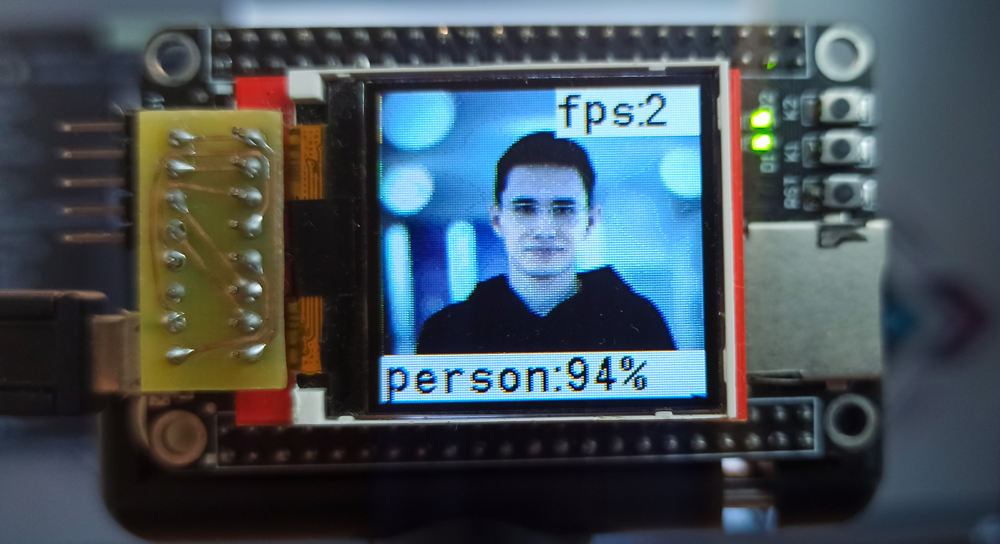

# TFLite_on_STM32
Neural network implementation on STM32 with TensorFlow Lite and STM32CubeIDE

Проект для демонстрации работы нейронных сетей на микроконтроллерах STM32.

## Hardware

Для экспериментов был собран стенд:


Изображение снимается на камеру [OV2640](https://mcustore.ru/store/datchiki-i-sensory/kamera-ov2640-1600x1200/) (*Разрешение матрицы датчика изображения: 1600x1200*).

Камера через плату-коннектор подключена к отладочной плате от [DevEBox]( https://github.com/mcauser/MCUDEV_DEVEBOX_H7XX_M ) c микроконтроллером STM32H743VIT6 (*480 MHz,  2M Flash, 1M RAM*).

Изображение и результат выводиться на [TFT LCD дисплей](https://arduino-kit.ru/product/displey-144_-color-tft-128h128-spi) 1.44 дюйма с контроллером ili9163 (*Разрешение матрицы 128x128*).

## TensorFlow Lite

 `download_tflite.sh` - скачивает **только** необходимы файлы библиотеки TFLite для сборки примеров в STM32CubeIDE. Необходимо добавить созданную директорию *TFLite* в *Include paths* и в *Source Location* в настройках проекта.

При отсутствии некоторых файлом можно обратиться к оригинальным репозиториям:

[tflite-micro](https://github.com/tensorflow/tflite-micro);

[ruy](https://github.com/google/ruy);

[fixedpoint](https://github.com/google/gemmlowp);

[flatbuffers](https://github.com/google/flatbuffers);

[CMSIS_5](https://github.com/ARM-software/CMSIS_5).

## Person detection example

Данные модели содержаться в файле `models_source/person_detect_example.h`.

Модель можно конвертировать из файла [person_detect.tflite](https://github.com/tensorflow/tflite-micro/blob/main/tensorflow/lite/micro/models/) c помощью:

```bash
xxd -i ./person_detect.tflite > person_detect_model_data.h
```

и изменить название массива с данными модели:

```c
const unsigned char g_person_detect_model_data[] = {
  0x1c, 0x00, 0x00, 0x00, 0x54, 0x46, 0x4c, 0x33, 0x00, 0x00, 0x00, 0x00,
  0x00, 0x00, 0x0e, 0x00, 0x18, 0x00, 0x04, 0x00, 0x08, 0x00, 0x0c, 0x00,
  ... ... ...
  0x00, 0x00, 0x08, 0x00, 0x0a, 0x00, 0x00, 0x00, 0x00, 0x00, 0x00, 0x01,
  0x02, 0x00, 0x00, 0x00
};
const unsigned int g_person_detect_model_data_len = 300568;
```



Нейронная сеть работает очень медленно (только 1-2 FPS). Cube-AI runtime работает быстрее. Смотри [AI_on_STM32](https://github.com/darkyfoxy/AI_on_STM32).

## Copyright

Some parts of this code were taken from other repositories. 

For OV2640 driver from [OpenMV repository](https://github.com/openmv/openmv).

For TFT ili9163 display driver from [Spirit532 repository](https://github.com/Spirit532/ILI9163C_STM32_HAL_DMA).

Other drivers without special instructions from STMicroelectronics.
